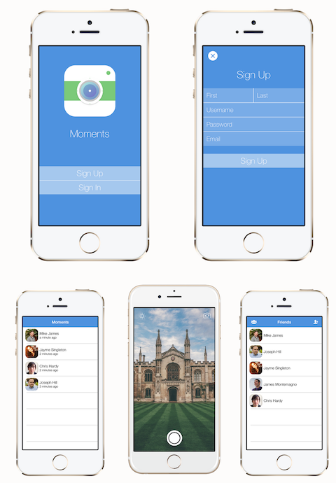
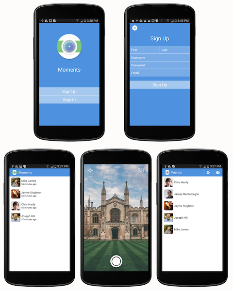
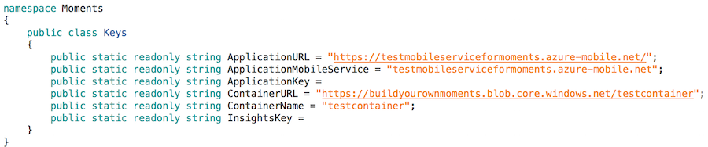

# **Note**: Moments is currently unmaintained, and parts of the app may not work as intended. 

# Moments
Moments is a Snapchat clone built using [Xamarin.Forms](https://xamarin.com/forms) and [Microsoft Azure](https://azure.microsoft.com/en-us/).

Text messaging is out-of-style! Everyone these days sends selfies, pictures of their food, and emojis instead. Duh. Moments allows you to send those selfies and pictures of your food to those that love you. You can even draw funny pictures on them! That's not even the best part! Moments is completely open-source, so you can [create your own SnapChat clone using Xamarin and Azure in just a few minutes](#build-your-own).

But seriously. Moments is awesome! If you've ever wondered how to use custom renderers in Xamarin.Forms, upload blobs from your Xamarin apps using Azure Storage, or how to maximize shared code with Plugins for Xamarin, Moments can show you how.

If you think this is awesome, please share a link to this repository on Twitter, LinkedIn, whatever. It would be much appreciated! :)

### Screenshots
##### iOS

##### Android

## Build Your Own

Moments uses Microsoft Azure for its back-end. To create host your own Moments
app follow the instructions below to:
* configure Azure Mobile Services,
* configure Azure Storage,
* setup Xamarin Insights, and
* add the required constants to the `Keys` class in the app

### Instructions

#### 1. Get the code
1. Clone or download *Moments* using either the command line or GitHub for Windows/Mac client.

#### 2. New Azure Mobile Service (for data)

2. To power our backend, including our accounts and friends system, we will be using Azure Mobile Services. Create a new [Azure Mobile Service](https://manage.windowsazure.com) - following these [instructions](https://azure.microsoft.com/en-us/documentation/articles/partner-xamarin-mobile-services-ios-get-started/#create-new-service) - under **New > Compute > Mobile Service > Create**. Be sure to choose the **BACKEND: Javascript** option (do *not* choose the .NET backend).

#### 3. New Azure Storage (for images)

3. We have to store your selfies somewhere! Create a new [Azure Storage account](https://manage.windowsazure.com) - following these [instructions](https://azure.microsoft.com/en-us/documentation/articles/storage-create-storage-account/#create-a-storage-account) - under **New > Data Services > Storage > Quick Create**.
4. Click on the Azure Storage account you just created and create a new container by clicking **CONTAINERS** from the top menu then **ADD** from the bottom. Name your container whatever you wish, but make sure to set **Access: Public Blob**.
5. Click **DASHBOARD** from the top menu in the  storage account then **MANAGE ACCESS KEYS** at the bottom. Take note of the "Storage Account Name" and "Primary Access Key" fields - they are required in the next step...

#### 4. Connecting the Storage and Mobile Service

6. Browse to the Azure Mbile Service created in step 2.1. and click **CONFIGURE**, then scroll down to the **app settings** section, and add two new key-value pairs:
   - STORAGE_ACCOUNT_NAME : *value from previous step*
   - STORAGE_ACCOUNT_ACCESS_KEY : *value from previous step*

7. Press **SAVE** at the bottom to persist the changes.

#### 5. Configuring the Service data backend
7. Check to see if Git access is enabled by going the mobile service's **DASHBOARD**. If you look on the right-hand side, you should see something like "Setup source control" OR a "source control user" already showing (if you have already used source control with Azure, you may see "Reset your source control credentials"). Source control must be configured with Azure before you can continue; remember the credentials you create, they are *not* the same as your Azure login.
8. Now go to the **CONFIGURE** tab for your Azure Mobile Service - you should see a Git URL. Copy this so that you can clone the repository on your Desktop (requries some familiarity with git). The basic steps are:
   - open **Terminal** or a command line prompt
   - `cd Desktop` (ie. navigate to the desktop or some other appropriate folder)
   - `git clone YOUR_MOBILE_SERVICE_GIT_URL_HERE` (will create a folder with the name of your service)
   - You'll be required to enter the Username and Password... this is *not* your Azure credentials, but the source control username and password you set-up previously.
   - when the cloning is complete, there will a folder with the same name as your Azure Mobile Service, containing another folder called **service** (with sub-folders like api, extensions, scheduler, shared, table).
9. Delete the contents of repository (ie. the **service** folder) you just cloned and copy in the files from the **Moments/Azure** directory - ensure there is a **service** folder with all the other directories beneath it.
10. Return to the command line **Terminal**
  - navigate to the folder containing the repository of your mobile service, eg `cd YOUR_MOBILE_SERVICE_NAME`
  - type `git add .` (the fullstop/point is important) This will allow Git to track all the new files in the directory
  - to commit the new files type `git commit`
  - type `A` for insert mode and then type a commit message
  - then press `ESC` follow by `:x` to exit the commenting mode *if you are using a Mac*
  - Type `git push`
11. In the Azure Mobile Service go to **DATA** and then click **CREATE** at the bottom to add four tables (so repeat four times):
  - `Account` with all the permissions set to "Anybody with the Application Key"
  - `User` with "Anybody with the Application Key"
  - `Friendship` with "Only Authenticated Users"
  - `Moment` with "Only Authenticated Users"
12. Go to the Azure Mobile Service **DASHBOARD** and click **MANAGE KEYS** at the bottom. Copy the **Master Key** for the next step.
13. Return to the **DATA** section and click the `Account` table, then click **SCRIPT** and choose **Insert** from the drop-down list. Copy the  [Account_Insert.js](https://github.com/pierceboggan/Moments/blob/master/Azure/service/table/account.insert.js) code - replacing `YOUR_MASTER_KEY_HERE` with the value from the previous step. Refer to [this blog](http://thirteendaysaweek.com/2013/12/13/xamarin-ios-and-authentication-in-windows-azure-mobile-services-part-iii-custom-authentication/) for more info on how it works. Be sure to click **SAVE** at the bottom to persist changes to the script.

The backend for your Snapchat clone is now complete. :)

#### 6. Xamarin Insights
14. We want to track everything that happens within our app, so visit the [Xamarin Insights portal](https://insights.xamarin.com/), create a new application, and copy/paste the API key for `Keys.cs` in the next step.

#### 7. Run the Xamarin App (iOS or Android)
15. Open the solution for *Moments* and navigate to `Helpers/Keys.cs`. Paste in relevant keys and information as seen below:
    
     These values come from:
     - `ApplicationURL` - Azure Mobile Services DASHBOARD > MOBILE SERVICE URL
     - `ApplicationMobileService` - Azure Mobile Services DASHBOARD > MOBILE SERVICE URL
     - `ApplicationKey` - Azure Mobile Services DASHBOARD > MANAGE KEYS > APPLICATION KEY
     - `ContainerURL` - Azure Storage CONTAINERS page NAME column
     - `ContainerName` - Azure Storage CONTAINERS page URL column
     - `InsightsKey` - Xamarin Insights configuration (using this is optional)
16. Build *Moments* for either an iOS or Android device, and watch it work its magic!

### Special Thanks
* All of the [libraries and projects](OpenSource.md) that made Moments possible.
* Mitch Milam for [DrawIt](https://github.com/MitchMilam/Drawit), which was used to implement drawing on moments before sending.
* [Imad Alazani](https://www.linkedin.com/pub/imad-alazani/63/376/368) for all his help testing Moments over the past few weeks.
* Christopher House for his blog post on [Custom Authentication with Azure / Xamarin](http://thirteendaysaweek.com/2013/12/13/xamarin-ios-and-authentication-in-windows-azure-mobile-services-part-iii-custom-authentication/).
